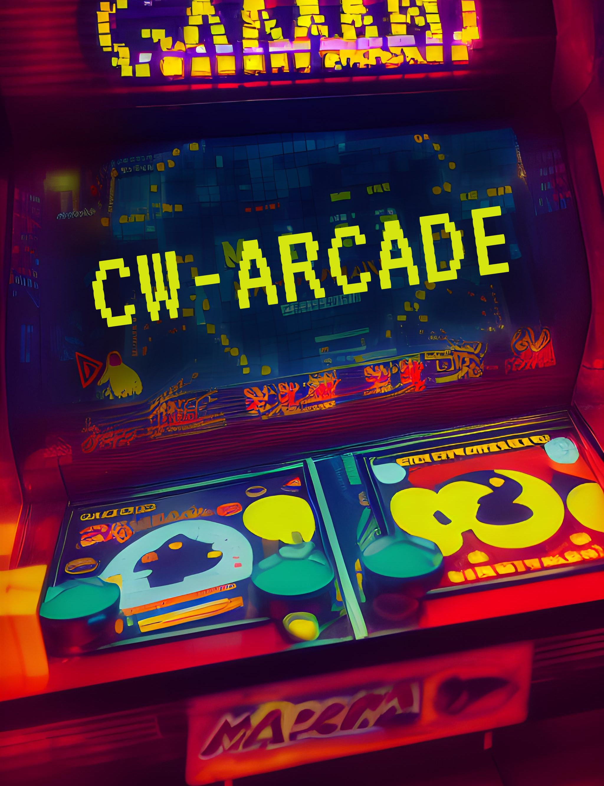

# cw-arcade

A Cosmos-based (CosmWasm) smart contract for building a decentralized arcade where users can play arcades like Tetris or
Pacman by paying a quarter, just like in old-school gaming arcade machines. Scores are stored securely on the
blockchain. You can choose the maximum amount of score records in the scoreboard when instantiating the smart contract
along with the price for each game. 

<!--  -->

[video demo](https://www.youtube.com/watch?v=q_12D2GZIxc&t=9s)

## Smart Contract Features

Investigate all potential queries and execute commands within the ./schema folder.

### instantiate msg

`{"admins": ["archway10mxcxvyjnpcmnkg0sxf7r25f3wzjqdz6jp4jux"], "arcade": "Pac-Man", "max_top_score": 3, "denom":"aconst", "price_peer_game": "250000000000000000"}`

### 1. Scoreboard Management

##### execute

Add top users with their address, nickname, and score
  
  **store user record**
  
  `archway tx --args '{"AddTopUser": {"user": {"address":"archway1uwew6p8k70xa2lkzeujqcw430uky49zthsvc0y", "name":"Wotori", "score":1}}}'`

  **store user record raw**
  
  `archwayd tx wasm execute --chain-id constantine-3 --gas auto --gas-prices $(archwayd q rewards estimate-fees 1 --node 'https://rpc.constantine.archway.tech:443' --output json | jq -r '.gas_unit_price | (.amount + .denom)') --gas-adjustment 1.4 archway1tykvjvpvfqr5g7f8uqqg5du8tp0h99jcgvf05xumtgcq3vf5vajsvp9v2e  '{"AddTopUser": {"user": {"address":"archway1uwew6p8k70xa2lkzeujqcw430uky49zthsvc0y", "name":"Wotori", "score":27000}}}' --from pacman --node https://rpc.constantine.archway.tech:443 -y`

##### query

query current scoreboard state
  `archway query contract-state smart --args '{"ScoreList":{}}'`

### 2. Play

This execute function is initiated by players on the dApp side. It receives payment from the user (akin to inserting a
quarter in old-school gaming machines). This sum of money is divided between the admins (for user store execution) and
the smart contract itself, which accumulates prize coins for future distribution to the top-ranking winner. Allows users to participate in the game (for dApp confirmation)

##### execute

`archwayd tx wasm execute --chain-id constantine-3 --gas auto --gas-prices $(archwayd q rewards estimate-fees 1 --node 'https://rpc.constantine.archway.tech:443' --output json | jq -r '.gas_unit_price | (.amount + .denom)') --gas-adjustment 1.4 archway12w38trruqfrkzsdmq9nlcnn9k5w3rmdlsqne5u89kwx69k8tn3ss2u9t0u '{"Play": {}}' --from pacman --amount 250000000000000000aconst --node https://rpc.constantine.archway.tech:443 -y`

### 3. Game Counter
Increment and track the total number of games played

archway cli query:
`archway query contract-state smart --args '{"GameCounter":{}}'`

raw-query:
`archwayd query wasm contract-state smart archway19cmtglphcfhrkyr3hd39dh598gl26vg9j6f5kp7y43k3879cscrs2tz6y4 '{"GameCounter":{}}' --node https://rpc.constantine.archway.tech:443`

### 4. Price Management

Update the price to participate in the game

  `command arguments in schema folder`

### 5. Prize Pool Management

- Add funds to the prize pool (just send coins to the smart contract address)
- Distribute prizes to winners (top 1 recieve all collected const)
  
  `archway query contract-state smart --args '{"PrizePool":{}}'`

### 6. Total Distributed Prizes

- Update and track the total amount of prizes distributed
  
  `archway query contract-state smart --args '{"TotalDistributed":{}}'`

### 7. Admins List Management

Only an admin is authorized to execute a command to add a user to the scoreboard. The intelligent contract validates
data before storing it in the storage. If the scoreboard is already full and a user achieves the highest score, securing
the 1st place, they receive all the deposited coins in the contract.

- Add admins
- Remove admins
- List all admins

add admin:
`archway tx --args '{"AddAdmin": {"admins": ["archway1uwew6p8k70xa2lkzeujqcw430uky49zthsvc0y"]}}'`

leave:
`archway tx --args '{"Leave": {}}'`

query admins:
`archway query contract-state smart --args '{"AdminsList":{}}'`

# Demo

You can explore the functionalities of this cw-arcade smart contract and delight in
playing [Pac-Man](https://wotori.github.io/arcade-pacman/).

<!--  -->

